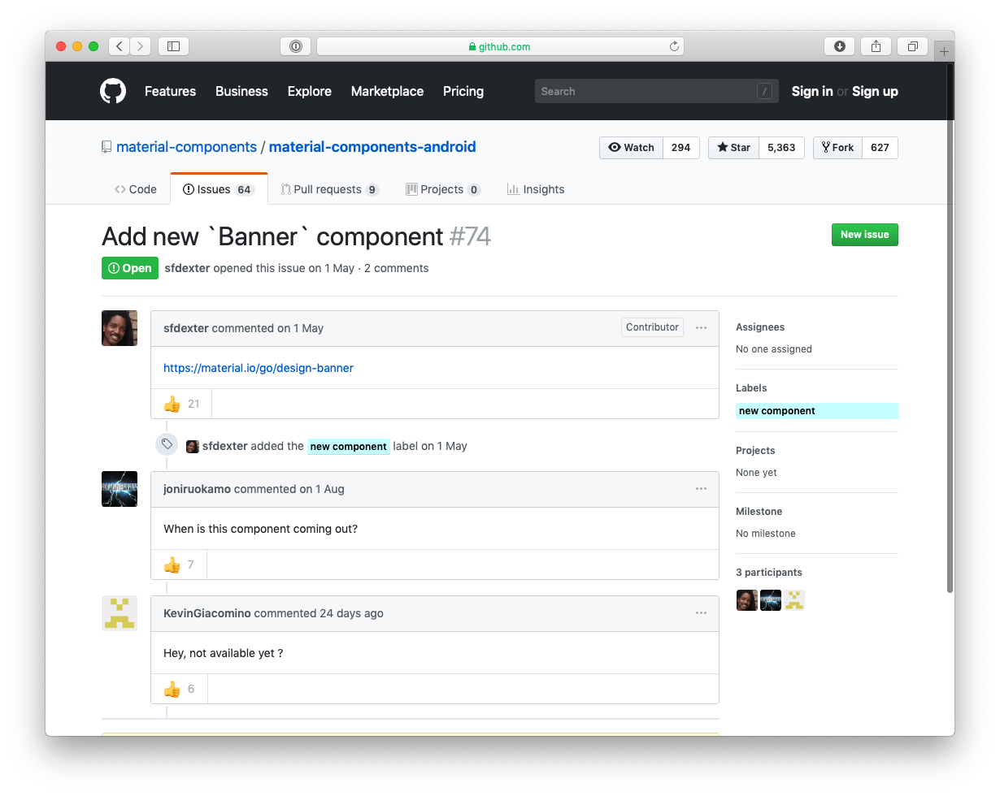

# Banners [](https://jitpack.io/#cesarferreira/MaterialComponent.Banner)

> A banner displays a prominent message and related optional actions.

<p align="center">
  
</p>

# Usage
in your `layout.xml`
```xml
  <com.cesar.materialcomponents.Banner
        android:id="@+id/banner"
        android:layout_width="match_parent"
        android:layout_height="wrap_content"
        android:background="#ccc"
        app:bannerBackgroundColor="@color/weird_green"
        app:contentText="Your password was updated on another device. Please sign in again"
        app:leftButtonText="Continue as Guest"
        app:rightButtonText="Sign in"/>
```

In your `activity.kt`
```kotlin
 banner.setLeftButtonAction { banner.dismiss() }
 banner.setRightButtonAction { navigator.goToSignIn() }
 ```

# Install
Just add the following dependency in your app's `build.gradle`

```groovy
allprojects { repositories { maven { url 'https://jitpack.io' } }}
```

```groovy
dependencies {
    implementation 'com.github.cesarferreira:MaterialComponent.Banner:0.13.0'
}
```

### Reason 
https://github.com/material-components/material-components-android/issues/74

<p align="center">
  
</p>
